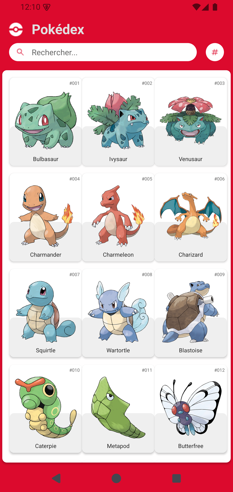
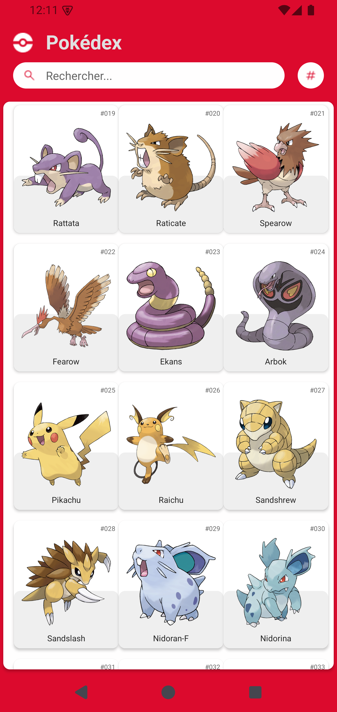
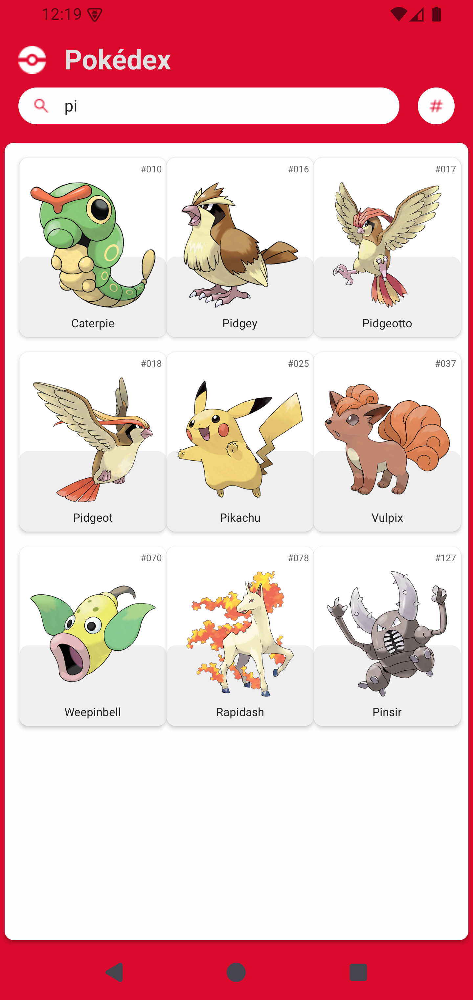
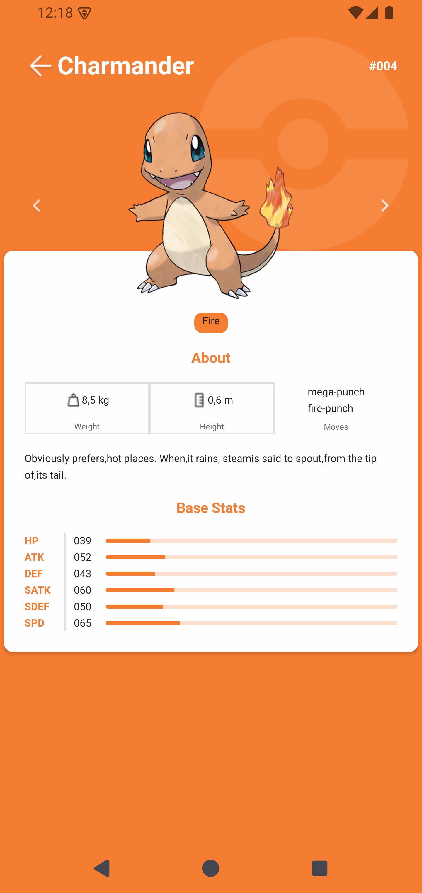
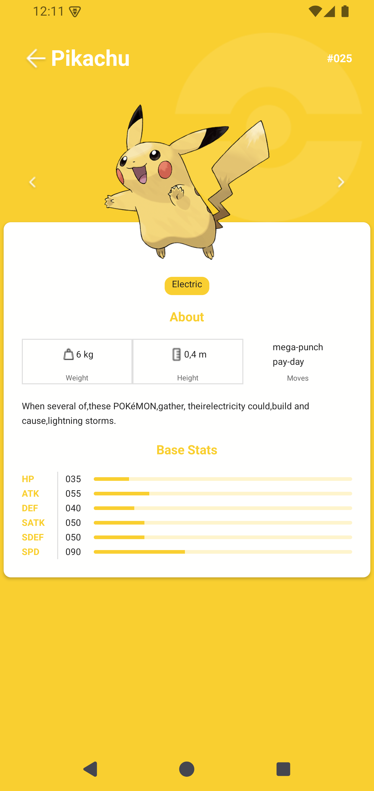
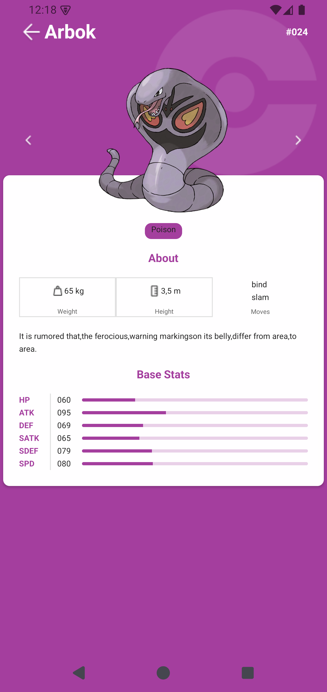
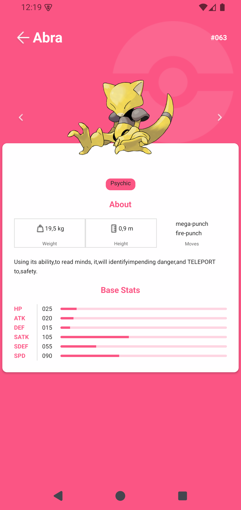

# 🚀 Pokédex React Native - Mobile Application

Languages: 🇺🇸 English | 🇫🇷 Français

## English

A modern **Pokédex mobile application** built with **React Native** and **Expo**, featuring a comprehensive Pokemon listing and detailed Pokemon information pages. Inspired by the beautiful [Figma Community Template](https://www.figma.com/design/9maERosJq6IwiBtShu2t7e/Pok%C3%A9dex--Community-?node-id=314-3&p=f&t=9KeTlxrThYkcRSOA-0).

## 📋 Table of Contents

- [📱 App Screenshots](#-app-screenshots)
- [🎥 Demo Video](#-demo-video)
- [🌟 Features](#-features)
- [🏗️ Project Structure](#%EF%B8%8F-project-structure)  
- [🛠️ Technologies Used](#%EF%B8%8F-technologies-used)
- [⚙️ Installation](#%EF%B8%8F-installation)
- [🚀 Usage](#-usage)
- [📡 API Integration](#-api-integration)
- [🎨 Design Inspiration](#-design-inspiration)
- [🧪 Testing](#-testing)
- [📝 Contributing](#-contributing)
- [📄 License](#-license)
- [👨‍💻 Author](#-author)

## 📱 App Screenshots

### 🏠 Pokemon List Views
<div align="center">
  
| Main Pokemon List | Alternative List View | Search Functionality |
|:-----------------:|:---------------------:|:--------------------:|
|  |  |  |

</div>

### 🔍 Pokemon Details Pages
<div align="center">

| Charmander #004 | Pikachu #025 | Arbok #024 | Abra #063 |
|:---------------:|:------------:|:----------:|:---------:|
|  |  |  |  |

</div>

## 🎥 Demo Video

<div align="center">
  <video width="300" controls>
    <source src="./Screen/Videos/PokemonSound.mp4" type="video/mp4">
    Your browser does not support the video tag.
  </video>
</div>

*Demo video showing the Pokemon cry sound feature when tapping on Pokemon artwork*

## 🌟 Features

✅ **Pokemon Listing** - Browse through a complete list of Pokemon with infinite scroll  
✅ **Search Functionality** - Find Pokemon by name or ID number  
✅ **Sort Options** - Sort Pokemon by ID or name  
✅ **Pokemon Details** - Comprehensive Pokemon information including:
- Basic stats (HP, Attack, Defense, etc.)
- Pokemon types with color coding
- Weight, Height, and Moves
- Pokemon description/biography
- High-quality artwork
- Pokemon cry sound effects

✅ **Interactive Navigation** - Swipe between Pokemon details with gesture support  
✅ **Sound Effects** - Tap Pokemon artwork to hear their unique cries  
✅ **Responsive Design** - Optimized for different screen sizes  
✅ **Dark/Light Theme Support** - Adaptive color schemes  
✅ **Cross-Platform** - Works on both iOS and Android

## 🏗️ Project Structure

```
PokedexReactNative/
├── 📁 app/                          # App screens and routing
│   ├── _layout.tsx                  # Root layout configuration
│   ├── index.tsx                    # Home screen (Pokemon list)
│   ├── about.tsx                    # About page
│   └── pokemon/
│       └── [id].tsx                 # Dynamic Pokemon details page
├── 📁 components/                   # Reusable UI components
│   ├── Card.tsx                     # Card wrapper component
│   ├── Row.tsx                      # Row layout component  
│   ├── RootView.tsx                 # Root view wrapper
│   ├── SearchBar.tsx                # Search input component
│   ├── SortButton.tsx               # Sort functionality button
│   ├── ThemeText.tsx                # Themed text component
│   └── pokemon/                     # Pokemon-specific components
│       ├── PokemonCard.tsx          # Pokemon list item card
│       ├── PokemonSpec.tsx          # Pokemon specifications
│       ├── PokemonStat.tsx          # Pokemon stats display
│       └── PokemonType.tsx          # Pokemon type badges
├── 📁 constants/                    # App constants and themes
│   ├── Colors.tsx                   # Color scheme definitions
│   └── Shadow.tsx                   # Shadow styling constants
├── 📁 functions/                    # Utility functions
│   └── pokemon.tsx                  # Pokemon-related helper functions
├── 📁 Hooks/                        # Custom React hooks
│   ├── UseFetchQuery.tsx            # API fetching hook
│   └── UseThemeColor.tsx            # Theme color hook
├── 📁 Screen/                       # App screenshots and media
│   ├── Pages/                       # Screenshot images
│   └── Videos/                      # Demo videos
├── app.json                         # Expo app configuration
├── package.json                     # Project dependencies
└── README.md                        # Project documentation
```

## 🛠️ Technologies Used

### 📱 **Mobile Framework**
- **React Native** `0.79.5` - Core mobile development framework
- **Expo** `~53.0.20` - Development platform and toolchain
- **Expo Router** `~5.1.4` - File-based routing system

### 🎨 **UI/UX Libraries**
- **React Native Reanimated** `~3.17.4` - Advanced animations
- **React Native Gesture Handler** `~2.24.0` - Touch gesture handling
- **React Native Pager View** `6.7.1` - Swipeable page navigation
- **Expo Image** `~2.4.0` - Optimized image rendering
- **Expo Blur** `~14.1.5` - Background blur effects

### 🔊 **Media & Audio**
- **Expo AV** `~15.1.7` - Audio and video playback
- **Expo Haptics** `~14.1.4` - Tactile feedback

### 🌐 **API & Data Management**
- **TanStack React Query** `^5.84.2` - Server state management
- **RESTful API Integration** - Pokemon API data fetching

### 🎭 **UI Components & Styling**
- **React Native Safe Area Context** `5.4.0` - Safe area handling
- **Expo Symbols** `~0.4.5` - System icons
- **Custom Theme System** - Dynamic color schemes

## ⚙️ Installation

### Prerequisites
- **Node.js** (v18 or higher)
- **npm** or **yarn**
- **Expo CLI** 
- **Android Studio** (for Android development)
- **Xcode** (for iOS development - macOS only)

### 🔧 Installation Steps

1. **Clone the repository**
```bash
git clone https://github.com/MrSalifDiallo/PokedexReactNative.git
cd PokedexReactNative
```

2. **Install dependencies**
```bash
npm install
# or
yarn install
```

3. **Install Expo CLI globally** (if not already installed)
```bash
npm install -g @expo/cli
```

4. **Start the development server**
```bash
npm start
# or
expo start
```

5. **Run on your device**
   - **iOS**: `npm run ios` or scan QR code with Camera app
   - **Android**: `npm run android` or scan QR code with Expo Go app
   - **Web**: `npm run web`

## 🚀 Usage

### 🏠 **Home Screen (Pokemon List)**
- Browse through the complete Pokemon list
- Use the search bar to find specific Pokemon by name or ID
- Sort Pokemon by ID number or alphabetical name
- Tap any Pokemon card to view detailed information
- Infinite scroll loading for smooth browsing experience

### 🔍 **Pokemon Details Page**  
- View comprehensive Pokemon information
- Tap the Pokemon artwork to hear their cry sound
- Swipe left/right to navigate between Pokemon
- Navigate back using the arrow button
- View Pokemon stats, types, moves, and biography

### 🔊 **Sound Features**
- Each Pokemon has their unique cry sound
- Tap the Pokemon image on detail page to play sound
- Audio automatically stops when navigating away

## 📡 API Integration

The app integrates with the **PokéAPI** (https://pokeapi.co/) to fetch:
- Pokemon basic information (name, ID, types)
- Detailed Pokemon stats and abilities  
- Pokemon species information and descriptions
- High-quality Pokemon artwork
- Pokemon cry sound files

### 🔄 **Data Fetching Features**
- **Infinite Scrolling** - Load Pokemon progressively
- **Caching** - Efficient data caching with TanStack Query
- **Error Handling** - Graceful error management
- **Loading States** - User-friendly loading indicators

## 🎨 Design Inspiration

This app is inspired by the beautiful [Figma Community Pokédex Template](https://www.figma.com/design/9maERosJq6IwiBtShu2t7e/Pok%C3%A9dex--Community-?node-id=314-3&p=f&t=9KeTlxrThYkcRSOA-0), featuring:

- **Modern Material Design** principles
- **Pokemon-themed color schemes** based on types
- **Smooth animations** and transitions
- **Intuitive navigation** patterns
- **Consistent typography** and spacing

## 🧪 Testing

Run the test suite:
```bash
npm test
# or
yarn test
```

## 📝 Contributing

Contributions are welcome! Please feel free to submit a Pull Request.

1. Fork the project
2. Create your feature branch (`git checkout -b feature/AmazingFeature`)
3. Commit your changes (`git commit -m 'Add some AmazingFeature'`)
4. Push to the branch (`git push origin feature/AmazingFeature`)
5. Open a Pull Request

## 📄 License

This project is licensed under the MIT License - see the [LICENSE](LICENSE) file for details.

## 👨‍💻 Author

**Salif Diallo**
- GitHub: [@MrSalifDiallo](https://github.com/MrSalifDiallo)
- LinkedIn: [Salif Diallo](https://www.linkedin.com/in/salif-diallo-152650313/)
- Mail: [salifdiallo@esp.sn](mailto:salifdiallo@esp.sn)

---

## Français

Une **application mobile Pokédex moderne** construite avec **React Native** et **Expo**, proposant une liste complète des Pokémon et des pages détaillées d'informations. Inspirée du magnifique [Template Community Figma](https://www.figma.com/design/9maERosJq6IwiBtShu2t7e/Pok%C3%A9dex--Community-?node-id=314-3&p=f&t=9KeTlxrThYkcRSOA-0).

## 📋 Table des Matières

- [🌟 Fonctionnalités](#-fonctionnalités)
- [📱 Captures d'Écran](#-captures-décran)
- [🎥 Vidéo de Démonstration](#-vidéo-de-démonstration)
- [🏗️ Structure du Projet](#%EF%B8%8F-structure-du-projet)
- [🛠️ Technologies Utilisées](#%EF%B8%8F-technologies-utilisées)
- [⚙️ Installation](#%EF%B8%8F-installation)
- [🚀 Utilisation](#-utilisation)
- [📡 Intégration API](#-intégration-api)
- [🎨 Inspiration Design](#-inspiration-design)
- [📄 Licence](#-licence)
- [👨‍💻 Auteur](#-auteur)

## 📱 Captures d'Écran

### 🏠 Vues Liste Pokémon
<div align="center">
  
| Liste Pokémon Principale | Vue Liste Alternative | Fonctionnalité de Recherche |
|:------------------------:|:---------------------:|:----------------------------:|
|  |  |  |

</div>

### 🔍 Pages Détails Pokémon
<div align="center">

| Salamèche #004 | Pikachu #025 | Arbok #024 | Abra #063 |
|:--------------:|:------------:|:----------:|:---------:|
|  |  |  |  |

</div>

## 🎥 Vidéo de Démonstration

<div align="center">
  <video width="300" controls>
    <source src="Screen/Videos/PokemonSound.mp4" type="video/mp4">
    Votre navigateur ne supporte pas la balise vidéo.
  </video>
</div>

*Vidéo de démonstration montrant la fonctionnalité de cri Pokémon lors du tap sur l'illustration*

## 🌟 Fonctionnalités

✅ **Liste des Pokémon** - Parcourez une liste complète de Pokémon avec défilement infini  
✅ **Fonction de recherche** - Trouvez des Pokémon par nom ou numéro ID  
✅ **Options de tri** - Triez les Pokémon par ID ou nom  
✅ **Détails Pokémon** - Informations complètes incluant :
- Statistiques de base (PV, Attaque, Défense, etc.)
- Types Pokémon avec codage couleur
- Poids, Taille et Attaques
- Description/biographie du Pokémon
- Illustrations haute qualité
- Effets sonores des cris Pokémon

✅ **Navigation interactive** - Balayez entre les détails Pokémon avec support gestuel  
✅ **Effets sonores** - Tapez sur l'illustration Pokémon pour entendre leurs cris uniques  
✅ **Design réactif** - Optimisé pour différentes tailles d'écran  
✅ **Support thème sombre/clair** - Schémas de couleurs adaptatifs  
✅ **Multi-plateforme** - Fonctionne sur iOS et Android

## 🏗️ Structure du Projet

```
PokedexReactNative/
├── 📁 app/                          # Écrans et routage de l'application
│   ├── _layout.tsx                  # Configuration du layout principal
│   ├── index.tsx                    # Écran d'accueil (liste Pokémon)
│   ├── about.tsx                    # Page à propos
│   └── pokemon/
│       └── [id].tsx                 # Page détails Pokémon dynamique
├── 📁 components/                   # Composants UI réutilisables
│   ├── Card.tsx                     # Composant wrapper de carte
│   ├── Row.tsx                      # Composant de layout en ligne
│   ├── RootView.tsx                 # Wrapper de vue racine
│   ├── SearchBar.tsx                # Composant de barre de recherche
│   ├── SortButton.tsx               # Bouton de fonctionnalité de tri
│   ├── ThemeText.tsx                # Composant de texte thématisé
│   └── pokemon/                     # Composants spécifiques Pokémon
│       ├── PokemonCard.tsx          # Carte d'élément de liste Pokémon
│       ├── PokemonSpec.tsx          # Spécifications Pokémon
│       ├── PokemonStat.tsx          # Affichage des stats Pokémon
│       └── PokemonType.tsx          # Badges de type Pokémon
├── 📁 constants/                    # Constantes et thèmes de l'app
│   ├── Colors.tsx                   # Définitions du schéma de couleurs
│   └── Shadow.tsx                   # Constantes de style d'ombre
├── 📁 functions/                    # Fonctions utilitaires
│   └── pokemon.tsx                  # Fonctions d'aide liées aux Pokémon
├── 📁 Hooks/                        # Hooks React personnalisés
│   ├── UseFetchQuery.tsx            # Hook de récupération API
│   └── UseThemeColor.tsx            # Hook de couleur de thème
├── 📁 Screen/                       # Captures d'écran et médias de l'app
│   ├── Pages/                       # Images de capture d'écran
│   └── Videos/                      # Vidéos de démonstration
├── app.json                         # Configuration de l'app Expo
├── package.json                     # Dépendances du projet
└── README.md                        # Documentation du projet
```

## 🛠️ Technologies Utilisées

### 📱 **Framework Mobile**
- **React Native** `0.79.5` - Framework de développement mobile principal
- **Expo** `~53.0.20` - Plateforme de développement et boîte à outils
- **Expo Router** `~5.1.4` - Système de routage basé sur fichiers

### 🎨 **Bibliothèques UI/UX**
- **React Native Reanimated** `~3.17.4` - Animations avancées
- **React Native Gesture Handler** `~2.24.0` - Gestion des gestes tactiles
- **React Native Pager View** `6.7.1` - Navigation par pages glissables
- **Expo Image** `~2.4.0` - Rendu d'images optimisé
- **Expo Blur** `~14.1.5` - Effets de flou d'arrière-plan

### 🔊 **Médias et Audio**
- **Expo AV** `~15.1.7` - Lecture audio et vidéo
- **Expo Haptics** `~14.1.4` - Retour tactile

### 🌐 **API et Gestion des Données**
- **TanStack React Query** `^5.84.2` - Gestion d'état serveur
- **Intégration API RESTful** - Récupération de données API Pokémon

### 🎭 **Composants UI et Style**
- **React Native Safe Area Context** `5.4.0` - Gestion de la zone sûre
- **Expo Symbols** `~0.4.5` - Icônes système
- **Système de Thème Personnalisé** - Schémas de couleurs dynamiques

## ⚙️ Installation

### Prérequis
- **Node.js** (v18 ou supérieur)
- **npm** ou **yarn**
- **Expo CLI**
- **Android Studio** (pour le développement Android)
- **Xcode** (pour le développement iOS - macOS uniquement)

### 🔧 Étapes d'installation

1. **Cloner le dépôt**
```bash
git clone https://github.com/MrSalifDiallo/PokedexReactNative.git
cd PokedexReactNative
```

2. **Installer les dépendances**
```bash
npm install
# ou
yarn install
```

3. **Installer Expo CLI globalement** (si pas déjà installé)
```bash
npm install -g @expo/cli
```

4. **Démarrer le serveur de développement**
```bash
npm start
# ou
expo start
```

5. **Exécuter sur votre appareil**
   - **iOS** : `npm run ios` ou scanner le QR code avec l'app Caméra
   - **Android** : `npm run android` ou scanner le QR code avec l'app Expo Go
   - **Web** : `npm run web`

## 🚀 Utilisation

### 🏠 **Écran d'accueil (Liste Pokémon)**
- Parcourez la liste complète des Pokémon
- Utilisez la barre de recherche pour trouver des Pokémon spécifiques par nom ou ID
- Triez les Pokémon par numéro ID ou nom alphabétique
- Tapez sur n'importe quelle carte Pokémon pour voir les informations détaillées
- Chargement par défilement infini pour une expérience de navigation fluide

### 🔍 **Page Détails Pokémon**
- Consultez les informations complètes du Pokémon
- Tapez sur l'illustration du Pokémon pour entendre son cri
- Balayez gauche/droite pour naviguer entre les Pokémon
- Revenez en arrière avec le bouton flèche
- Consultez les stats, types, attaques et biographie du Pokémon

### 🔊 **Fonctionnalités sonores**
- Chaque Pokémon a son cri unique
- Tapez sur l'image du Pokémon sur la page de détails pour jouer le son
- L'audio s'arrête automatiquement lors de la navigation

## 📡 Intégration API

L'application s'intègre avec **PokéAPI** (https://pokeapi.co/) pour récupérer :
- Informations de base des Pokémon (nom, ID, types)
- Statistiques et capacités détaillées des Pokémon
- Informations d'espèces et descriptions Pokémon
- Illustrations Pokémon haute qualité
- Fichiers sonores de cris Pokémon

### 🔄 **Fonctionnalités de Récupération de Données**
- **Défilement Infini** - Chargement progressif des Pokémon
- **Mise en Cache** - Mise en cache efficace des données avec TanStack Query
- **Gestion d'Erreurs** - Gestion gracieuse des erreurs
- **États de Chargement** - Indicateurs de chargement conviviaux

## 🎨 Inspiration Design

Cette application est inspirée du magnifique [Template Community Figma Pokédex](https://www.figma.com/design/9maERosJq6IwiBtShu2t7e/Pok%C3%A9dex--Community-?node-id=314-3&p=f&t=9KeTlxrThYkcRSOA-0), présentant :

- **Principes de Material Design Moderne**
- **Schémas de couleurs thème Pokémon** basés sur les types
- **Animations fluides** et transitions
- **Modèles de navigation intuitifs**
- **Typographie et espacement cohérents**

## 🧪 Tests

Exécutez la suite de tests :
```bash
npm test
# ou
yarn test
```

## 📝 Contribution

Les contributions sont les bienvenues ! N'hésitez pas à soumettre une Pull Request.

1. Forkez le projet
2. Créez votre branche de fonctionnalité (`git checkout -b feature/SuperFonctionnalite`)
3. Committez vos changements (`git commit -m 'Ajouter une SuperFonctionnalite'`)
4. Poussez vers la branche (`git push origin feature/SuperFonctionnalite`)
5. Ouvrez une Pull Request

## 📄 Licence

Ce projet est sous licence MIT - voir le fichier [LICENSE](LICENSE) pour plus de détails.

## 👨‍💻 Auteur

**Salif Diallo**
- GitHub: [@MrSalifDiallo](https://github.com/MrSalifDiallo)
- LinkedIn: [Salif Diallo](https://www.linkedin.com/in/salif-diallo-152650313/)
- Mail: [salifdiallo@esp.sn](mailto:salifdiallo@esp.sn)

---

*Développé avec ❤️ en React Native | Inspiré par la communauté Pokémon*
